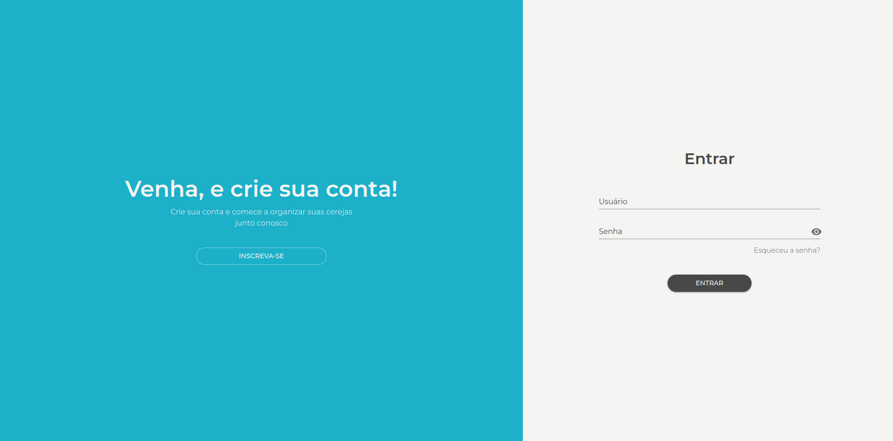

# Cherry task

##### _Organize suas cerejas do dia a dia_

O cherry task é uma aplicação com a premissa de ajudar o seu usuário a se organizar com suas tarefas do dia a dia



_"A verdadeira organização começa dentro de você!"_

## Tecnologias

Aqui vai as principais tecnologias utilizadas para construir esta aplicação

- [React](https://react.dev/)
- [TRPC](https://trpc.io/)
- [Turbo repo](https://turbo.build/)
- [Node.js](https://nodejs.org/en)

## Rode o projeto

1. Primeiro clone o projeto:

Com chave SSH

```sh
git@github.com:julioceno/cherry-task.git
```

Com HTTPS

```sh
https://github.com/julioceno/cherry-task.git
```

2. Depois instale as dependências de desenvolvimento, na raiz do projeto rode o seguinte comando:

```sh
yarn
```

3. Ajuste as variáveis de ambiente, olhe os arquivos `.env.example`, tanto no frontend quanto no backend

4. suba o container docker

```sh
yarn workspace api docker-compose -f docker/docker-compose.yml up -d
```

5. Na raiz do projeto, rode o seguinte comando

```sh
yarn dev
```

## License

[MIT](./LICENSE)
